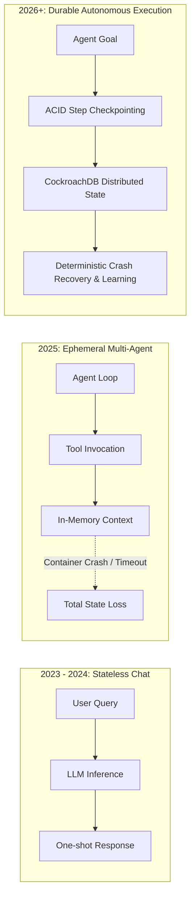
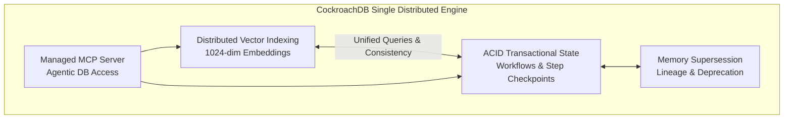

# Market Requirements Document (MRD)
# REASSEMBLE — Durable Agent Memory

**Document Version:** 1.0.0  
**Date:** August 18, 2026  
**Status:** Approved / Hackathon Release  
**Target Release:** August 19, 2026, 02:30 AM IST  
**Authors:** REASSEMBLE Product & Strategy Team  
**Repository:** `reassemble-starter`  

---

## 1. Market Overview & Industry Dynamics

### 1.1 The Shift from Conversational Bots to Autonomous Agents
The enterprise AI landscape has shifted decisively from stateless conversational assistants (chatbots) toward **autonomous multi-step operational agents**. These agents are tasked with executing complex, mutating, long-running workflows:
- Triaging infrastructure incidents and applying remediation runbooks.
- Coordinating multi-service database migrations.
- Executing financial reconciliations and compliance validations.
- Managing multi-cloud CI/CD deployment pipelines.

According to industry market analysis in 2025–2026:
- The **AI Agent Infrastructure Market** is projected to grow from **$5.1B in 2024 to over $28.5B by 2029 (CAGR ~41%)**.
- Over **75% of Global 2000 enterprises** are prototyping or deploying autonomous agents in production IT and DevOps pipelines.
- However, **82% of enterprise AI teams cite runtime reliability, crash recovery, and state volatility** as the primary blockers preventing autonomous agents from receiving full production write access.



### 1.2 The Durable Execution Imperative
In traditional enterprise computing, long-running tasks rely on **durable execution frameworks** (e.g., Temporal, Cadence, AWS Step Functions) to guarantee that state transitions survive machine failures, network partitions, and process crashes. 

However, existing AI agent frameworks (LangChain, CrewAI, AutoGen) were designed around in-memory loop paradigms. When an agent pod dies or an AWS Lambda function times out, the entire context window, step progression, and operational hypothesis are permanently lost.

---

## 2. Problem Space & Market Pain Points

### 2.1 The Critical Failures in Current Agent Architectures

| Problem Category | Technical Reality | Impact on Enterprise Operations |
| :--- | :--- | :--- |
| **State Loss on Worker Crash** | Agents maintain state in volatile memory (Python process heap). Unhandled exceptions, spot instance terminations, or serverless timeouts erase all progress. | Incomplete mutations leave infrastructure in broken half-states; human intervention is mandatory. |
| **Non-Deterministic Reruns** | Because LLMs are probabilistic, restarting a failed agent from Step 1 produces different plans, duplicate API calls, and wasted token spend. | Financial and operational risk; unpredictable side-effects on production systems. |
| **Memory Drift & Stale Ground Truth** | Standard vector stores (Pinecone, Chroma, Qdrant) store unversioned embeddings. When operational facts change, agents retrieve obsolete runbooks. | Agents execute wrong remediation (e.g., expanding database pool size when the true fix is rolling back a leaky release). |
| **Dual-Write Consistency Penalty** | Teams stitch together a relational DB (PostgreSQL for checkpoints) and a vector DB (Pinecone for semantic memory). | Distributed synchronization failures, dual-write race conditions, and doubled operational surface area. |

---

## 3. Competitive Landscape & Market Positioning

### 3.1 Competitive Comparison Matrix

| Feature / Capability | **REASSEMBLE** | **LangChain / LangGraph** | **CrewAI** | **AutoGen** | **Temporal.io** | **Mem0 / Zep** |
| :--- | :---: | :---: | :---: | :---: | :---: | :---: |
| **Distributed Vector Storage** | **CockroachDB Native** | External Vector DB | External Vector DB | External Vector DB | None | External / Custom |
| **ACID Checkpointing in Same DB** | **Yes (Unified Engine)** | No (SQLite/Postgres) | No (In-memory) | No (In-memory) | Yes (Workflow only) | No (Memory only) |
| **Memory Supersession (Versioned Truth)** | **Yes (`supersedes` link)** | No | No | No | N/A | Partial |
| **Deterministic Crash Recovery** | **Sub-500ms from DB** | Manual / Custom | None | None | Yes (Non-AI) | None |
| **Managed MCP Agent Introspection** | **Yes (Native CRDB MCP)** | No | No | No | No | No |
| **Serverless Ready (AWS Lambda)** | **Yes (Zero-Cold-Start)** | High overhead | Container only | Container only | Heavy Workers | Cloud API |
| **Multi-Region Distributed Resilience** | **Yes (CockroachDB)** | No | No | No | Yes (Self-hosted) | No |

### 3.2 Competitor Deep-Dive
1. **LangChain / LangGraph:** While LangGraph introduced state graph concepts, checkpointing typically writes to local SQLite or separate PostgreSQL instances while vector search requires a completely separate vector database. It lacks built-in knowledge supersession and distributed resilience.
2. **CrewAI / AutoGen:** Designed for in-memory multi-agent collaboration. State is lost if the hosting process exits. Memory modules are rudimentary and lack transactional semantics.
3. **Temporal.io:** Gold standard for deterministic workflow orchestration in microservices, but does not offer native semantic vector indexing, embedding cosine similarity, or LLM-centric knowledge evolution.
4. **Mem0 / Zep:** Focus exclusively on conversational user memory (chat history summaries) rather than infrastructure workflow checkpointing, transactional state recovery, and distributed database co-location.

---

## 4. Unique Value Proposition (UVP)

```
+-------------------------------------------------------------------------+
|                                                                         |
|                "RAG RETRIEVES. REASSEMBLE RECONSTRUCTS."                |
|                                                                         |
+-------------------------------------------------------------------------+
```

### 4.1 Why Retrieval Alone is Insufficient
Retrieval-Augmented Generation (RAG) fetches documents matching a prompt. But autonomous agents do not just need documents—they need **state, intent, progress, and lineage**. 

If an agent executing a 10-step migration fails at step 7:
- **RAG** can tell the agent what a migration is.
- **REASSEMBLE** tells the agent that steps 1–6 succeeded, provides the exact database handle and connection pool ID generated in step 5, warns that step 6 discovered a connection leak, and instructs the newly spawned worker to resume execution at step 7 without restarting.

### 4.2 Core Architectural Pillars



1. **Unified Storage Engine:** CockroachDB handles both relational ACID checkpoints and distributed vector similarity search in the same cluster, completely eliminating dual-write hazards.
2. **Deterministic Step Reconstruction:** Any newly spawned worker (Lambda, Fargate, EC2) instantly reconstructs full workflow context from CockroachDB in under 500ms.
3. **Memory Evolution (Supersession):** Empirical incident discoveries automatically supersede outdated runbooks, ensuring agents always act on current reality.
4. **Enterprise LLM Integration:** Powered by Amazon Bedrock (Amazon Nova Lite for ultra-fast reasoning and Amazon Titan Text Embeddings V2 for 1024-d embeddings).

---

## 5. Target Market Segments & Use Cases

### 5.1 Primary Market Segments

```
+---------------------------------------------------------------------------+
| Segment 1: Autonomous SRE & Automated Cloud Incident Remediation          |
| -> Target: Platform Engineering, SRE teams, Cloud Operations              |
| -> Need: Crash-resilient incident triage that won't corrupt cloud state.   |
+---------------------------------------------------------------------------+
| Segment 2: Long-Running Enterprise Agent Workflows                        |
| -> Target: Financial Services, Logistics, Legal Tech Automation           |
| -> Need: Transactional verification of multi-step document/data pipelines.|
+---------------------------------------------------------------------------+
| Segment 3: AI Developer Frameworks & Agent Platforms                      |
| -> Target: AI Engineers, Agent Framework Maintainers, SaaS Builders      |
| -> Need: A plug-and-play durable memory backend for custom agents.        |
+---------------------------------------------------------------------------+
```

### 5.2 Flagship Use Case: Automated Checkout Latency Remediation
- **Scenario:** E-commerce checkout latency spikes following deployment v2.8.
- **Traditional Agent Failure:** Agent starts diagnosing, retrieves an old runbook recommending a connection pool increase, crashes mid-execution due to a Lambda timeout, restarts from scratch, and loops indefinitely.
- **REASSEMBLE Execution:**
  1. Agent starts incident triage and commits Step 1 (Health Check) and Step 2 (Metrics Query) to CockroachDB.
  2. Worker is terminated mid-operation (Crash simulation).
  3. Replacement worker spawns, queries CockroachDB, immediately reads Checkpoint 2, and skips completed steps.
  4. Agent queries CockroachDB vector index and retrieves validated Incident #208 findings, identifying that a connection leak was introduced in v2.8.
  5. Agent recognizes that Incident #208 supersedes older pool-increase recommendations (Incident #191), issues a rollback recommendation, and logs complete audit provenance.

---

## 6. Key Differentiators & Competitive Moats

### 6.1 Unified Distributed Vector + ACID Relational Engine
By leveraging CockroachDB Cloud, REASSEMBLE avoids the architectural fragmentation plaguing modern AI stacks. Developers get:
- Single connection string (`pg8000` / PostgreSQL wire protocol).
- Single backup, replication, and disaster recovery lifecycle.
- Zero distributed transaction coordination bugs between vector indices and state tables.

### 6.2 Active Memory Supersession Framework
Most vector memory systems accumulate conflicting embeddings indefinitely. REASSEMBLE introduces first-class relational lineage:
- `supersedes UUID` references prior invalid memories.
- Queries filter active truths while maintaining historical auditability.
- Prevents hallucination loops caused by outdated operational guidelines.

### 6.3 Native Managed MCP Protocol Integration
CockroachDB’s managed Model Context Protocol (MCP) server enables AI development environments (such as Cursor, VS Code, or Claude Desktop) to:
- Directly introspect schema definitions.
- Inspect active and interrupted workflows.
- Run operational SQL verification queries directly from the engineer's prompt context.

---

## 7. Go-To-Market (GTM) Strategy & Product Roadmap

```mermaid
timeline
    title REASSEMBLE Commercialization & Open Source Roadmap
    section Phase 1: Hackathon MVP
        August 2026 : Working Lambda + CockroachDB + Bedrock Demo
                    : Web UI for Crash & Resume Simulation
                    : Managed MCP Server Verification
    section Phase 2: Open Source SDK
        Q4 2026     : Python SDK (`pip install reassemble-agent`)
                    : LangGraph & CrewAI Checkpointer Integrations
                    : Auto-Heartbeat Liveness Watchdog
    section Phase 3: Enterprise Cloud
        Q1-Q2 2027  : Multi-Tenant Managed Memory Plane
                    : SOC2 / HIPAA Compliance & Encryption Keys
                    : Multi-Region Global Active-Active Agent Clustering
```

### 7.1 Phase 1: Hackathon MVP & Community Awareness (August 2026)
- Open-source starter repository with zero-friction AWS Lambda and CockroachDB deployment.
- Live interactive demo showcasing instant worker recovery and memory supersession.
- Technical documentation, PRD, MRD, and architecture walkthroughs for developers.

### 7.2 Phase 2: Open-Source Framework & Integrations (Q4 2026)
- Release `reassemble-py` client library providing drop-in checkpointer adapters for:
  - `LangGraph` (`CockroachDBSaver`)
  - `CrewAI` (`DurableStorageHandler`)
  - `AutoGen` (`DurableAgentRuntime`)
- Automated watchdog daemon for background heartbeat monitoring and transparent failover.

### 7.3 Phase 3: Enterprise Managed Agent Cloud (Q1–Q2 2027)
- Enterprise multi-tenant SaaS control plane.
- Fine-grained Role-Based Access Control (RBAC) and Row-Level Security (RLS) for multi-agent teams.
- Global active-active multi-region replication powered by CockroachDB’s distributed consensus.

---

## 8. Success Criteria for Hackathon Judges

To evaluate the engineering excellence, market relevance, and technical execution of REASSEMBLE, judges should assess the project against the following six criteria:

| Criterion | Evaluation Metric | Demonstrated Proof in REASSEMBLE |
| :--- | :--- | :--- |
| **1. Innovation & Value Proposition** | Does the project solve an urgent, unsolved problem in the AI agent ecosystem? | Solves agent state volatility by combining ACID workflow checkpointing with distributed vector memory. |
| **2. Deep CockroachDB Integration** | Does the project exploit distinctive CockroachDB capabilities? | Uses **Distributed Vector Indexing (`VECTOR(1024)`)**, ACID relational transactions, and **Managed MCP server** tooling. |
| **3. Amazon Bedrock Utilization** | Are AWS foundation models used effectively? | Uses **Amazon Nova Lite** for high-efficiency reasoning and **Amazon Titan Embeddings V2** for 1024-d embeddings. |
| **4. Live Crash & Recovery Demo** | Does state survive an abrupt worker termination? | The demo interactively crashes worker at step 2 and successfully resumes from CockroachDB checkpoint without data loss. |
| **5. Memory Supersession & Learning** | Can the agent differentiate between old advice and validated new facts? | Accurately favors Incident #208 rollback remediation over superseded Incident #191 connection-pool advice. |
| **6. Production-Ready Architecture** | Is the codebase clean, modular, and deployable? | Fully functional serverless architecture with single-file Lambda handler, schema migration scripts, and comprehensive PRD/MRD. |
