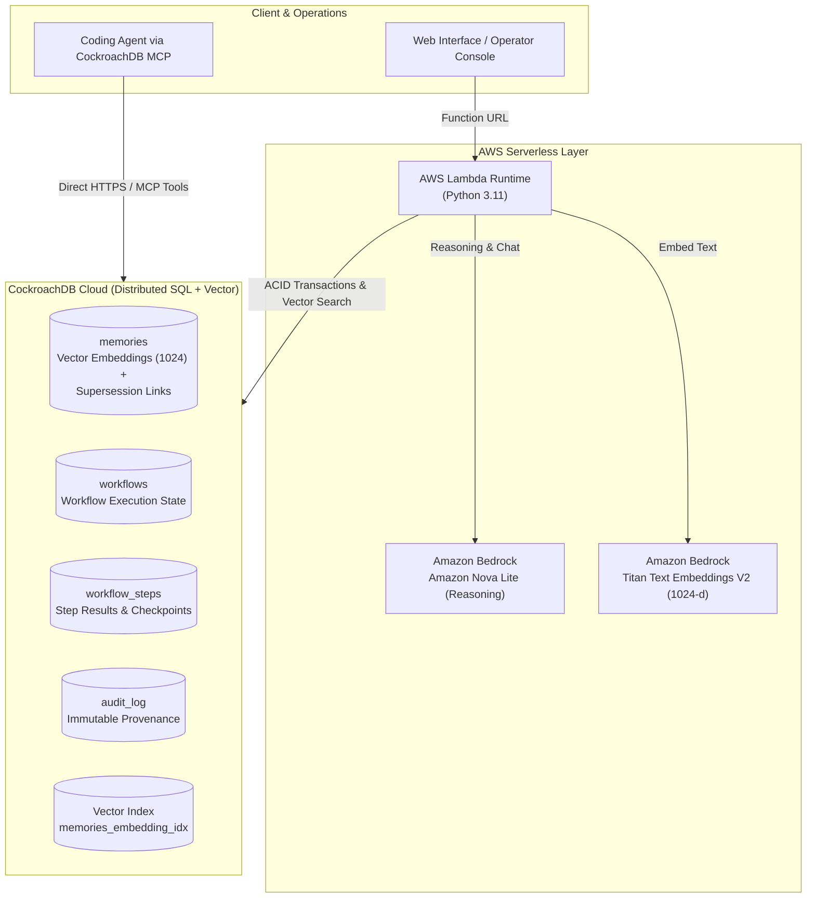

# Product Requirements Document (PRD)
# REASSEMBLE — Durable Agent Memory

**Document Version:** 1.0.0  
**Date:** August 18, 2026  
**Status:** Approved / Hackathon MVP  
**Target Release:** August 19, 2026, 02:30 AM IST  
**Authors:** REASSEMBLE Core Engineering Team  
**Repository:** `reassemble-starter`  

---

## 1. Executive Summary

Autonomous AI agents are increasingly entrusted with complex, multi-step workflows across cloud infrastructure, incident management, and software operations. However, contemporary agent architectures suffer from a foundational flaw: **agent state is volatile and ephemeral**. When an agent runtime crashes, restarts, or times out, its in-memory reasoning context, active plan, execution trace, and operational learnings evaporate. Re-running non-deterministic Large Language Models (LLMs) from scratch is expensive, dangerous in mutating operational environments, and frequently leads to inconsistent behavior or repeated errors.

**REASSEMBLE** is a resilient, distributed memory and execution recovery layer for autonomous AI agents. By combining **CockroachDB’s distributed vector indexing and ACID transactional guarantees** with **Amazon Bedrock’s foundation models (Amazon Nova Lite and Amazon Titan Text Embeddings V2)** and **AWS Lambda's serverless runtime**, REASSEMBLE provides:
1. **Durable Step Checkpointing:** Relational transactional persistence for multi-step agent workflows.
2. **Deterministic State Reconstruction:** Instantaneous crash recovery without re-executing completed operations.
3. **Evolving Semantic Memory:** Long-term semantic knowledge retrieval with built-in memory supersession (allowing validated discoveries to overwrite outdated operational assumptions).
4. **Agentic Database Introspection:** Native integration with CockroachDB's Managed Model Context Protocol (MCP) server for real-time schema and audit inspection.

> **Motto:** *Remember. Recover. Learn.*  
> **Core Philosophy:** *RAG retrieves. Reassemble reconstructs.*

---

## 2. Problem Statement

### 2.1 The Volatility Crisis in Autonomous Agents
Modern AI agents running on serverless containers or ephemeral compute instances (e.g., AWS Lambda, Kubernetes pods, worker nodes) maintain active execution state within the Python heap or local memory. If a network blip, container recycling event, timeout, or uncaught exception occurs:
- **Total State Loss:** The agent loses its step position, execution variables, intermediate tool outputs, and hypothesis trees.
- **Expensive & Non-Deterministic Reruns:** LLM inference is fundamentally non-deterministic. Re-triggering an agent from step 1 may result in entirely different tool invocations, duplicate external mutations (e.g., re-allocating cloud resources or re-firing alert webhooks), and excessive API token consumption.
- **No Native Crash Recovery:** Existing frameworks (LangChain, CrewAI, AutoGen) treat memory as conversation history buffers or external vector-only databases, lacking atomic, transactional workflow recovery primitives.

### 2.2 Memory Drift and Stale Knowledge Hallucinations
Traditional vector databases store embeddings statically. In dynamic cloud environments, operational facts evolve rapidly:
- An engineer modifies a connection pool configuration.
- A deployment introduces a connection leak that invalidates previous runbook guidance.
- Agents relying on naive vector search retrieve stale or conflicting lessons, leading to harmful remediation actions (e.g., continuously bumping connection pool sizes instead of rolling back a faulty release).

### 2.3 The Dual-Engine Penalty
Architectures that separate transactional state (e.g., PostgreSQL/DynamoDB) from vector search (e.g., Pinecone/Milvus) introduce distributed dual-write consistency hazards, network latency overheads, and complex distributed state coordination.

---

## 3. Product Vision & Goals

### 3.1 Vision Statement
To establish the industry standard for **zero-loss, transactionally durable AI agent runtimes**, enabling autonomous agents to execute mission-critical enterprise workflows with the same resilience, fault tolerance, and ACID guarantees expected of modern distributed databases.

### 3.2 Strategic Goals
- **Eliminate Volatile State Loss:** Guarantee 100% workflow state recovery after arbitrary worker crashes.
- **Unify Vector and Relational Memory:** Consolidate workflow checkpointing, step logs, audit trails, and vector embeddings into a single distributed CockroachDB cluster.
- **Enable Self-Correcting Long-Term Memory:** Implement structured memory supersession so agents organically deprecate stale facts when newer, validated ground truths emerge.
- **Zero-Cold-Start Developer Experience:** Provide an open, extensible Python reference architecture deployable on AWS Lambda with a single command and immediate UI verification.

---

## 4. Target Personas & Users

| Persona | Primary Role | Core Pain Point | How REASSEMBLE Solves It |
| :--- | :--- | :--- | :--- |
| **DevOps / Cloud Platform Engineer** | Automating infrastructure provisioning, rollbacks, and multi-cloud operations. | Agent crashes mid-provisioning leave orphaned cloud infrastructure and half-applied Terraform states. | ACID-backed step checkpoints guarantee exact-step resumption with complete idempotency and audit logs. |
| **Site Reliability Engineer (SRE)** | Autonomous incident triage, diagnosis, and automated remediation. | Agents apply outdated runbook recommendations or get killed by Lambda timeouts mid-incident. | Vector memory with supersession ensures only validated root-cause fixes are executed; workflow resumes seamlessly across workers. |
| **AI Agent Developer / Architect** | Building autonomous multi-agent pipelines (LangGraph, CrewAI, custom agents). | Stitching together separate vector DBs, caches, and state machines creates dual-write bugs and high operational overhead. | Single-database architecture using CockroachDB for relational state + 1024-dim vector indexing, with Bedrock reasoning. |
| **Enterprise Security & Compliance Lead** | Auditing autonomous AI decisions and compliance postures. | Black-box LLM decisions cannot be verified, traced, or deterministically reproduced after execution. | Persistent, immutable `audit_log` tracking every intent, step execution, and retrieved memory citation. |

---

## 5. Core Features & Capabilities



### 5.1 Semantic Memory with Distributed Vector Indexing
- **Embedding Generation:** Uses Amazon Bedrock's `amazon.titan-embed-text-v2:0` to produce high-density 1024-dimensional normalized embeddings for all ingested operational facts, incidents, runbooks, and architectural decisions.
- **Distributed Vector Index:** Uses CockroachDB's native `VECTOR(1024)` data type and `CREATE VECTOR INDEX` for horizontal scaling, distributed cosine-distance similarity queries, and sub-millisecond retrieval.
- **Contextual Ingestion:** Stores memory metadata including `memory_type` (`incident`, `runbook`, `architecture`, `lesson`, `current_fact`), `confidence` (0.0 to 1.0), and originating `source`.

### 5.2 Transactional Workflow Checkpointing
- **Atomic State Transitions:** Workflows track `workflow_id`, overall `status` (`RUNNING`, `INTERRUPTED`, `COMPLETED`, `FAILED`), `incident` description, and `last_completed_step`.
- **Granular Step Checkpointing:** Each intermediate phase is recorded in `workflow_steps` with `(workflow_id, step_number)` as composite primary keys, capturing input parameters, execution status, and structured step outputs.
- **ACID Integrity:** Checkpoints are committed transactionally via PostgreSQL wire protocol (`pg8000`), guaranteeing that a step is only marked complete once its output is safely written to distributed storage.

### 5.3 Deterministic Crash Recovery
- **Runtime-Agnostic Resumption:** When a worker is killed (simulated or organic container failure), a replacement worker receives the `workflow_id`, queries CockroachDB for `last_completed_step`, and reconstructs the exact workflow state.
- **Zero Re-Execution of Completed Steps:** The agent bypasses previously finished steps (e.g., Step 1: Health Check, Step 2: Metric Query) and immediately executes Step 3 (Diagnostic Hypothesis) and Step 4 (Remediation).
- **Transient Memory Independence:** No in-memory cache, shared memory, or sticky sessions are required.

### 5.4 Memory Supersession & Evolving Knowledge
- **Lineage Tracking:** The `memories` table includes a `supersedes UUID` foreign pointer and a `status` field (`active` vs `superseded`).
- **Dynamic Truth Resolution:** When new empirical incident findings contradict historical runbooks (e.g., Incident #208 proves connection leaks caused latency, superseding Incident #191's pool-increase advice), the legacy memory is superseded.
- **Filtered Semantic Search:** Semantic retrieval prioritizes `status = 'active'` while preserving lineage for root-cause auditability.

### 5.5 Comprehensive Audit Logging & MCP Introspection
- **Immutable Audit Trail:** All state transitions, memory lookups, crash events, and recovery triggers write structured records to `audit_log`.
- **Managed MCP Integration:** External developer agents (e.g., Cursor, Claude Desktop) connect via CockroachDB's Managed MCP server to query database tables, inspect active checkpoints, and verify system state in real time.

---

## 6. User Stories

### US-01: Incident Workflow Initiation
- **As a** Site Reliability Engineer,
- **I want** the agent to initiate a structured 4-step diagnostic and remediation workflow upon receiving an alert,
- **So that** incident triage begins immediately and all actions are recorded in CockroachDB.

### US-02: Mid-Execution Worker Crash
- **As an** Operations Lead,
- **I want** the system to gracefully handle worker termination during Step 2 of an active remediation,
- **So that** incomplete operations do not leave the system in an unknown or corrupted state.

### US-03: Zero-Loss Workflow Reconstruction
- **As a** DevOps Engineer,
- **I want** a newly spawned Lambda worker to resume the interrupted workflow from Checkpoint 2,
- **So that** steps 1 and 2 are not re-executed and the workflow proceeds to completion without duplicate side effects.

### US-04: Grounded Knowledge Retrieval
- **As an** Incident Responder,
- **I want** to query the agent (*"Why is checkout latency high and what should we do?"*),
- **So that** the response synthesizes relevant runbooks and recent incidents retrieved via CockroachDB vector search.

### US-05: Superseded Memory Handling
- **As a** Platform Architect,
- **I want** the agent to ignore superseded pool-sizing advice and prioritize validated rollback recommendations from Incident #208,
- **So that** remediation actions reflect the most accurate, up-to-date engineering knowledge.

### US-06: Operator Live Inspection via MCP
- **As a** Developer using an AI coding assistant,
- **I want** my IDE agent to connect to CockroachDB via Managed MCP,
- **So that** I can inspect live tables, run verification queries, and validate checkpoints directly from my editor.

---

## 7. Success Metrics & Key Performance Indicators (KPIs)

| Metric | Target (Hackathon MVP) | Enterprise Target | Measurement Method |
| :--- | :--- | :--- | :--- |
| **Workflow State Recovery Time** | `< 500 ms` | `< 100 ms` | Time elapsed from Lambda invocation with `workflow_id` to reconstruction of prior step context. |
| **State Loss on Worker Crash** | **0.0%** | **0.0%** | Verification that 100% of committed steps survive immediate container termination. |
| **Vector Retrieval Latency** | `< 150 ms` | `< 30 ms` | CockroachDB vector index search execution time for 1024-dim cosine distance. |
| **Semantic Accuracy / Relevance** | `> 90%` top-3 precision | `> 98%` | Human evaluation of retrieved incident memories matching the checkout latency scenario. |
| **End-to-End Demo Completion Rate** | `100%` (5/5 steps) | `99.99%` | Flawless execution across Start $\rightarrow$ Crash $\rightarrow$ Resume $\rightarrow$ Ask $\rightarrow$ Inspect. |
| **Cold Start Overhead** | `< 2.5 s` | `< 800 ms` | Total latency of first Lambda invocation including DB connection initialization. |

---

## 8. Technical Architecture & Component Specifications

### 8.1 Architecture Matrix

| Layer | Component | Specification / Configuration | Role in REASSEMBLE |
| :--- | :--- | :--- | :--- |
| **Storage & State** | **CockroachDB Cloud** | Serverless / Basic Cluster, PostgreSQL wire-compatible, distributed architecture | Stores vector embeddings, workflow states, step checkpoints, and audit logs. |
| **Vector Indexing** | **CockroachDB Vector** | `VECTOR(1024)`, Cosine distance, `CREATE VECTOR INDEX` | Distributed semantic search over agent long-term memory. |
| **MCP Layer** | **CockroachDB Managed MCP** | HTTPS MCP endpoint, service-account API key auth | Enables agentic IDE/external tools to inspect live database schema and state. |
| **LLM Reasoning** | **Amazon Bedrock** | `amazon.nova-lite-v1:0` (Amazon Nova Lite) | High-speed, cost-effective reasoning, hypothesis generation, and answer synthesis. |
| **Embedding Model**| **Amazon Bedrock** | `amazon.titan-embed-text-v2:0` (1024 dimensions) | Generates semantic vector representations of operational memories and user queries. |
| **Compute / Runtime**| **AWS Lambda** | Python 3.11 runtime, Public Function URL, stateless worker | Hosts the agent logic, REST endpoints, and interactive web dashboard. |
| **Database Driver** | **pg8000** | Pure Python DB-API 2.0 PostgreSQL driver | Lightweight, zero-native-dependency connection to CockroachDB from Lambda. |

### 8.2 Database Schema (`schema.sql`)

```sql
-- Long-term semantic knowledge with vector embeddings and supersession lineage
CREATE TABLE IF NOT EXISTS memories (
  id UUID PRIMARY KEY DEFAULT gen_random_uuid(),
  memory_type STRING NOT NULL,
  content STRING NOT NULL,
  embedding VECTOR(1024) NOT NULL,
  confidence FLOAT8 NOT NULL DEFAULT 0.5,
  source STRING,
  status STRING NOT NULL DEFAULT 'active',
  created_at TIMESTAMPTZ NOT NULL DEFAULT now(),
  valid_until TIMESTAMPTZ NULL,
  supersedes UUID NULL
);

-- Active and historical workflow execution states
CREATE TABLE IF NOT EXISTS workflows (
  workflow_id UUID PRIMARY KEY,
  status STRING NOT NULL,
  incident STRING NOT NULL,
  last_completed_step INT NOT NULL DEFAULT 0,
  total_steps INT NOT NULL DEFAULT 4,
  updated_at TIMESTAMPTZ NOT NULL DEFAULT now()
);

-- Granular step-level checkpoints and outputs
CREATE TABLE IF NOT EXISTS workflow_steps (
  workflow_id UUID NOT NULL,
  step_number INT NOT NULL,
  name STRING NOT NULL,
  status STRING NOT NULL,
  result STRING,
  updated_at TIMESTAMPTZ NOT NULL DEFAULT now(),
  PRIMARY KEY (workflow_id, step_number)
);

-- Immutable audit log for actions and state changes
CREATE TABLE IF NOT EXISTS audit_log (
  id UUID PRIMARY KEY DEFAULT gen_random_uuid(),
  workflow_id UUID,
  action STRING NOT NULL,
  details STRING,
  created_at TIMESTAMPTZ NOT NULL DEFAULT now()
);

-- CockroachDB distributed vector index for fast semantic lookup
CREATE VECTOR INDEX IF NOT EXISTS memories_embedding_idx ON memories (embedding);
```

### 8.3 REST API Endpoints (Lambda Function URL)

| Method | Path | Description | Request Payload | Response Payload |
| :--- | :--- | :--- | :--- | :--- |
| `GET` | `/` | Serves the interactive single-page web application dashboard. | None | `text/html` |
| `POST` | `/api/start` | Creates a new workflow record and executes Step 1 & Step 2. | `{ "incident": string }` | `{ "workflow_id": UUID, "status": string, "steps": [...] }` |
| `POST` | `/api/crash` | Simulates unexpected worker termination during Step 2. | `{ "workflow_id": UUID }` | `{ "workflow_id": UUID, "status": "INTERRUPTED", ... }` |
| `POST` | `/api/resume` | Reconstructs state from CockroachDB and completes Steps 3 & 4. | `{ "workflow_id": UUID }` | `{ "workflow_id": UUID, "status": "COMPLETED", ... }` |
| `POST` | `/api/chat` | Performs vector search and invokes Nova Lite reasoning. | `{ "message": string }` | `{ "answer": string, "retrieved_memories": [...] }` |
| `GET` | `/api/memories` | Fetches active and superseded memory traces. | None | `{ "memories": [...] }` |

---

## 9. Out of Scope for MVP

The following enterprise features are deliberately excluded from the August 18–19 Hackathon MVP to maximize demo reliability and focus on core architectural differentiation:

1. **Enterprise Authentication & Multi-Tenancy:** Single-tenant demo environment with public Lambda Function URL (Auth type: `NONE`).
2. **Automated Heartbeat / Watchdog Daemon:** Worker failure is explicitly triggered via the simulation button rather than an automated liveness timeout.
3. **Arbitrary Graph Execution Engine:** Workflows use a structured 4-step incident remediation pipeline rather than dynamic DAG generation.
4. **Hardware Key Management / Client-Side Encryption:** Database encryption relies on CockroachDB Cloud default encryption-at-rest.
5. **Real-time WebSocket Streaming:** Updates are polled via asynchronous REST API calls.

---

## 10. Project Timeline & Delivery Milestones

```
Current Time: August 18, 2026 ~21:05 IST
Hackathon Submission Deadline: August 19, 2026, 02:30 AM IST (Remaining: ~5h 25m)
```

| Phase / Time (IST) | Milestone | Deliverables / Status |
| :--- | :--- | :--- |
| **Phase 1: 18:00 – 20:00** | **Infrastructure & Database Setup** | CockroachDB cluster provisioned, `schema.sql` applied, `VECTOR(1024)` index created, Bedrock Nova Lite & Titan v2 permissions verified. *(Completed)* |
| **Phase 2: 20:00 – 21:15** | **Core Runtime Implementation** | Lambda handler (`lambda_function.py`), pg8000 pooling, Titan embedding pipeline, Nova Lite reasoning prompt, web UI implemented. *(Completed)* |
| **Phase 3: 21:15 – 22:30** | **Product & Market Documentation** | Detailed PRD (`docs/prd.md`), MRD (`docs/mrd.md`), architectural diagrams, and judge evaluation guides written. *(In Progress)* |
| **Phase 4: 22:30 – 00:30** | **End-to-End Testing & Polish** | Local regression testing, Lambda deployment verification, Function URL testing, MCP server integration validation. |
| **Phase 5: 00:30 – 02:00** | **Demo Video & Presentation Deck** | 3-minute video recording following `docs/demo-script.md`, screenshots, Devpost submission copy. |
| **Phase 6: 02:00 – 02:30** | **Final Submission & Review** | Repository cleanup, release tagging, Devpost submission finalized before 02:30 AM IST cutoff. |

---

## 11. Acceptance Criteria & Test Matrix

To pass final acceptance testing for hackathon evaluation, REASSEMBLE must satisfy the following verifiable criteria:

### AC-01: Vector Indexing & Semantic Search
- [x] CockroachDB table `memories` stores 1024-dimensional vectors generated by Amazon Bedrock Titan Text Embeddings V2.
- [x] Cosine distance vector search (`<->` or `<=>`) retrieves top-3 relevant incident context records within `< 200 ms`.
- [x] Nova Lite agent successfully incorporates retrieved memories into synthesis responses.

### AC-02: Transactional Step Checkpointing
- [x] Triggering `/api/start` creates a valid `workflows` row and commits Steps 1 & 2 into `workflow_steps`.
- [x] Each step write is an independent ACID transaction with timestamps and output payloads.

### AC-03: Crash Simulation & Durable State Preservation
- [x] Triggering `/api/crash` sets workflow status to `INTERRUPTED`.
- [x] Inspecting CockroachDB confirms Step 1 and Step 2 records remain intact with `last_completed_step = 2`.
- [x] No data corruption occurs in `workflow_steps` or `audit_log`.

### AC-04: Resumption & State Reconstruction
- [x] Triggering `/api/resume` reads `last_completed_step`, skips Steps 1 & 2, and executes Steps 3 & 4.
- [x] Workflow status updates to `COMPLETED`.
- [x] Full audit trail is written to `audit_log`.

### AC-05: Memory Supersession Verification
- [x] UI Memory Trace displays legacy records (Incident #143, Incident #191) alongside active superseding records (Incident #208).
- [x] Agent answers accurately prioritize rollback remediation over connection pool increases.

### AC-06: Managed MCP Server Accessibility
- [x] Cursor / external AI agent successfully connects to `.cursor/mcp.json` endpoint.
- [x] Tool execution (`list_tables`, `get_table_schema`, `select_query`) returns live CockroachDB schema and data.
